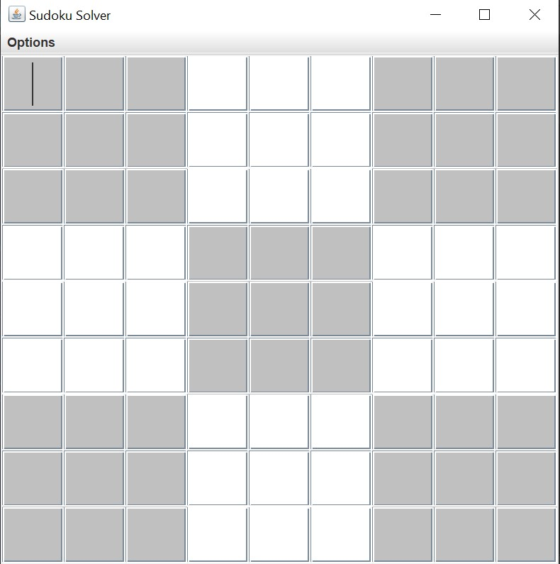
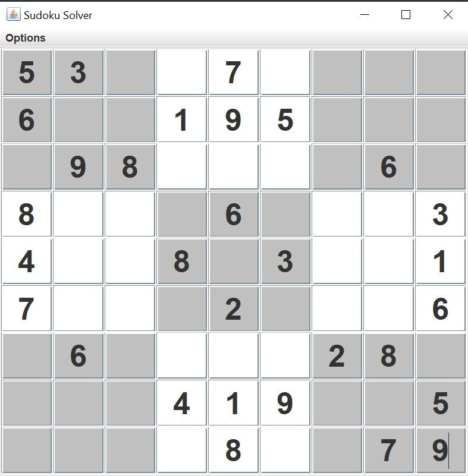
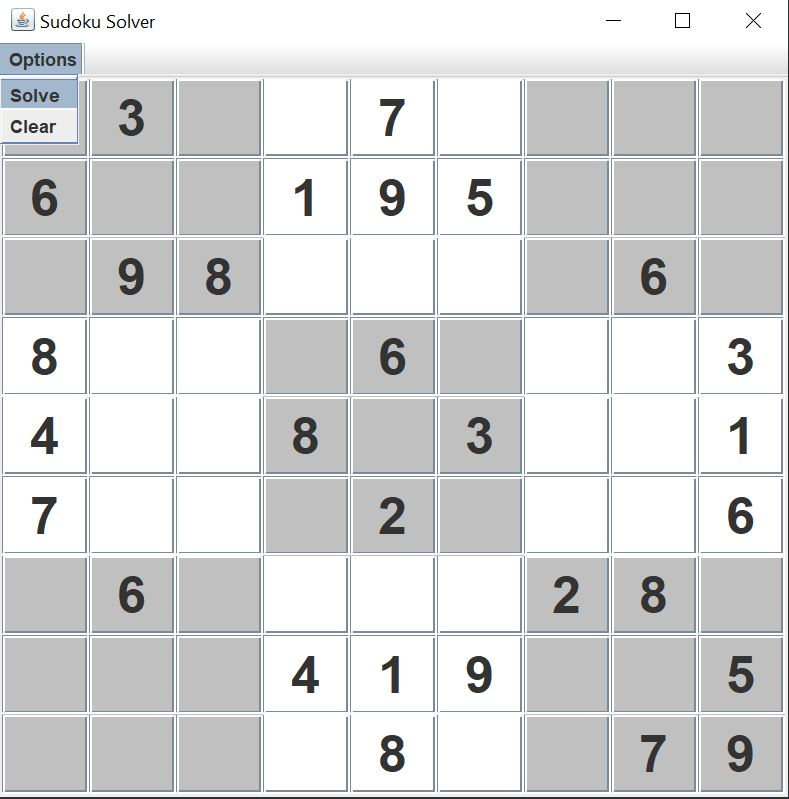
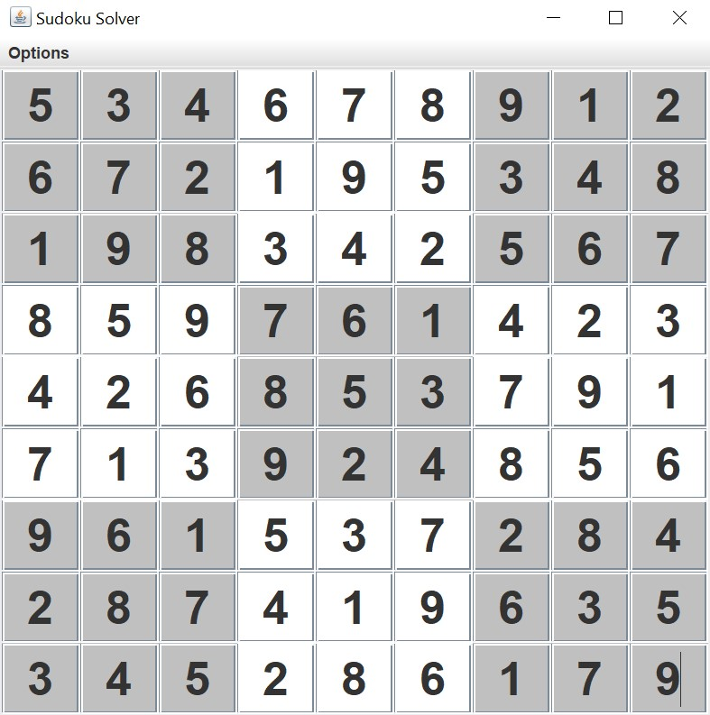
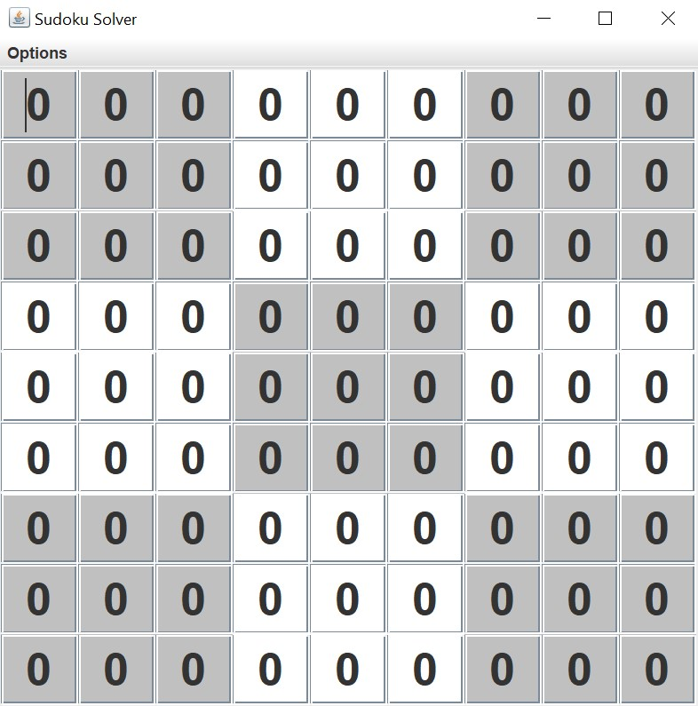
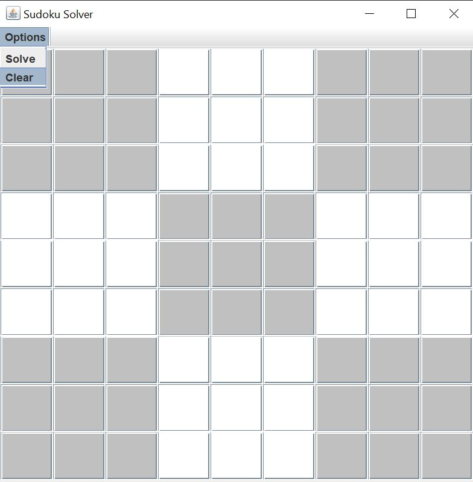

# Sudoku Solver
This program display's a 9x9 grid, in which a user inputs the grid to be solved. The output can be seen on the GUI once solve has been clicked.

## Initial Startup and Filling in the Board
When the program is launched, an empty grid can be seen. Fill in the known values by clicking on the boxes and typing in the value.

## Solving the Board
To solve the board, click "Options" and click "Solve".

## Error on Board
If a value inputted is not an integer between 1 and 9, or the board you have provided cannot be solved, a board of all 0's signifies this board has an error.

## Clearing the Board
To clear the board so that all input fields are empty, click "Options" and click "Clear".

